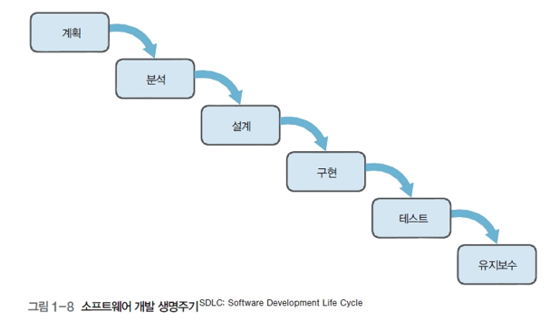
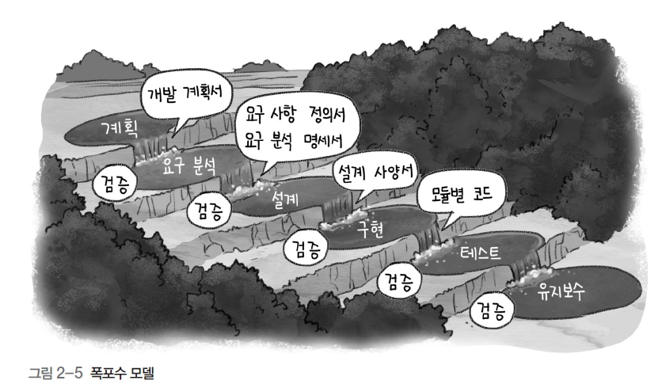
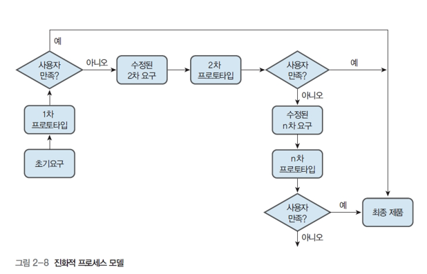
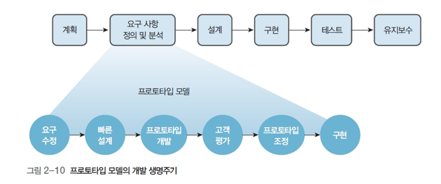

참고한 책: IT CookBook, 쉽게 배우는 소프트웨어 공학(김치수, 한빛아카데미)

---

#### 소프트웨어 개발 생명주기(SDLC Software Development Life Cycle)
- 계획 단계에서 유지보수 단계에 이르기까지 일어나는 일련의 과정

#### 소프트웨어 개발 단계
##### 소프트웨어 개발 프로세스
1. 계획
- 개발 비용 산정: COCOMO모델, 기능점수(FP)모델 사용
- 일정 계획: 작업분할구조도(WBS), CPM 사용
- 위험 관리
2. 요구분석
- 기존 시스템의 문제점 파악 -> 새로운 요구사항 도출 -> 다이어그램 작성
- 개발 방법론에 따른 표현 도구
  - 구조적 방법론: DFD, DD, Mini Spec
  - 정보공학 방법론: E-R 다이어그램
  - 객체지향 방법론: UML의 유스케이스 다이어그램
- 최종 산출물: 요구 분석 명세서
3. 설계
- 설계 원리: 분할과 정복, 추상화, 단계적 분해, 모듈화, 정보은닉
- 소프트웨어 아키텍처, 객체지향 설계
- 아키텍처 스타일
- GoF의 디자인 패턴
- 모듈 평가 기준: 응집도와 결합도
4. 구현
- 간략한 프로그래밍 언어의 역사
- 표준 코딩 규칙
5. 테스트
- 테스트의 절차
- 개발자 또는 사용자 시각에 따른 분류
- 사용되는 목적에 따른 분류
- 품질 특성에 따른 분류
- 소프트웨어 개발 단계에 따른 분류
6. 유지보수
- 수정 유지보수
- 적응 유지보수
- 기능보강 유지보수
- 예방 유지보수

#### 소프트웨어 개발 프로세스
- 선형순차적 모델(폭포수 모델)
- 진화적 프로세스 모델(프로토타입 모델)
- 애자일 프로세스 모델
- 등등

### 선형 순차적 모델
선형순차적 모델의 대표: waterfall 모델

#### 폭포수 모델의 개발 절차
1. 계획
2. 요구분석
3. 설계
4. 구현
5. 테스트
6. 유지보수

#### 폭포수 모델의 장점
- 관리의 용이
- 체계적인 문서화
- 요구사항의 변화가 적은 프로젝트에 적합

#### 폭포수 모델의 단점
- 각 단계는 앞 단계가 완료되어야 수행할 수 있다
- 각 단계의 결과물이 완벽한 수준으로 작성되어야 다음 단계에 오류를 넘겨주지 않는다
- 사용자가 중간에 가시적인 결과를 볼 수 없어 답답해할 수 있다

### 진화적 프로세스 모델
진화적 프로세스 모델의 대표: 프로토타입 모델

프로토타입: 대량 생산에 앞서 미리 제작해보는 원형 또는 시제품으로, 제작물의 모형

소프트웨어 개발에서의 포로토타입: 정식 절차에 따라 완전한 소프트웨어를 만들기 전에 사용자의 요구를 받아 일단 모형을 만들고 이 모형을 사용자와 의사소통하는 도구로 활용
ex. 모델하우스

#### 프로토타입 모델의 개발 생명주기

#### 프로토타입 모델의 개발 절차
1. 요구사항 정의 및 분석
   - 1차 개략적인 요구 사항 정의 후 2차, 3차, ... n차를 반복하면서 최종 프로토타입 개발
2. 프로토타입 설계
    - 완전한 설계 대신, 사용자와 대화할 수 있는 수준의 설계
    - 입출력 화면을 통한 사용자 인터페이스 중심 설계
3. 프로토타입 개발
    - 완전히 동작하는 완제품을 개발하는 것이 아님
    - 입력 화면을 통한 사용자의 요구 항목 확인
    - 출력 결과를 통해 사용자가 원하는 것인지 확인
4. 사용자에 의한 프로토타입 평가
    - 프로토타입 평가 -> 추가 및 수정 요구 -> 프로토타입 개발 -> 다시 프로토타입 평가
5. 구현
   - 최종 프로토타입 개발

### 애자일 프로세스 모델
- 애자일(agile): 날렵한, 민첩한
- 애자일 프로세스 모델: 고객의 요구에 민첩하게 대응하고 그때그때 주어지는 문제를 풀어가는 방법론
- 애자일의 기본 가치(애자일 선언문)
  - 프로세스와 도구 중심이 아닌, 개개인과의 상호 소통 중시
  - 문서 중심이 아닌, 실행 가능한 소프트웨어 중시
  - 계약과 협상 중심이 아닌, 고객과의 협력 중시
  - 계획 중심이 아닌, 변화에 대한 민첩한 대응 중시

#### 애자일의 개발 방법
- 반복적인 개발을 통한 잦은 출시를 목표로 함
- 프로토타입 개발 -> 사용자 확인 -> 일부 기능 사용

| 구분             | 애자일 방법론                                     | 폭포수 모델                        |
|----------------|---------------------------------------------|-------------------------------|
| 추가 요구 사항의 수용   | 추가 요구사항을 수용할 수 있는 방법의 설계                    | 추가 요구사항을 반영하기 어려운 구조          |
| 릴리스 시점         | 수시로 릴리즈                                     | 최종 완성된 제품을 릴리스                |
| 시작 상태          | 시작 단계는 미흡, 점차 완성도가 높아짐                      | 시작 단계에서의 완성도가 매우 높음           |
| 고객과의 의사소통      | 처음부터 사용자의 참여 유도, 대화를 통한 개발 진행               | 사용자와 산출물의 근거 중심, 대화 부족        |
| 진행 상황 점검       | 개발자와 사용자는 개발 초기부터 진행 상황 공유                  | 단계별 산출물에 대한 결과로 개발의 진척 상황을 점검 |
| 분석/설계/구현 진행 과정 | 하나의 단계 또는 반복 안에 분석/설계/구현 과정이 모두 포함되어 동시에 진행 | 분석/설계/구현 과정이 명확               |
| 모듈(컴포넌트) 통합    | 개발 초기부터 빈번한 통합. 문제점을 빨리 발견하고 수정하는 방식        | 구현이 완료된 후에 모듈 간의 통합 작업을 수행    |

---

### UML

[ch02_UML.pdf](https://hyper-star-6be.notion.site/UML-PDF-197a1aae696280119b6ffaad652a38da?pvs=4)

