📦 첫 번째 단계: 사전학습 모델 이해하기   
사전학습 모델의 개념과 필요성, 그리고 그것이 왜 이미지 분류에서 강력한 도구로 사용되는지를 알아봅니다.

### 스테이지1. 프로젝트 준비와 데이터 이해

학습 목표
- 프로젝트 기본 폴더 구조와 데이터 파일 구성 이해
- 데이터 준비 과정에서 필요한 폴더 생성 및 파일 압축 해제 방법 습득
- Pandas를 사용한 CSV 데이터 로드 및 기본적인 데이터 탐색 방법 이해
- 이미지 데이터의 파일 경로 처리 및 랜덤 샘플 시각화 실습
- 이미지 파일의 기본 속성(크기, 해상도, 색상 모드) 이해

#### 현재 폴더 구조
1. sing_train.csv: 학습 데이터 포함 CSV 파일. FOR 모델 훈련
2. sign_test.csv: 테스트 데이터 포함 CSV 파일. FOR 모델 성능 평가
3. sign_sub.csv: 제출 CSV 파일. FOR 모델 예측 결과 저장
4. sign_train.zip: 학습 데이터 이미지 파일 압축 ZIP 파일. 압축 해제 후 학습용 이미지 파일 사용
5. sign_test.zip: 테스트 데이터 이미지 파일 압축 ZIP 파일. 압축 해제 후 테스트용 이미지 파일 사용

**CSV 파일이란   
쉼표(,)로 구분된 텍스트 데이터를 저장하는 파일 형식

#### 들어가며...
- 프로젝트의 기본 폴더와 파일 구조를 확인 -> 필요한 폴더 생성 -> 데이터 압축 파일을 해제
- Pandas를 이용해 CSV 파일로 제공된 학습 데이터를 로드하고, 데이터가 어떤 형태로 구성되어 있는지 탐색할 것
- 이미지 파일들의 경로를 처리하고 램덤으로 샘플 이미지를 시각화할 것


#### 1. 폴더 생성 함수

- sign_train.zip, sign_test.zip 압축 파일 풀기
  - sign_train 및 sign_test 폴더 생성
  - 압축 해제한 각 파일을 해당 폴더에 넣고 각 폴더 내용 출력

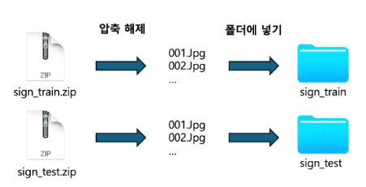

##### 1. 모듈 임포트
```python
import os # os: 운영 체제와 상호작용하기 위한 모듈. 디렉토리 생성, 파일 경로 확인 등
import zipfile # zipfile: ZIP 파일을 읽고 쓰기 위한 모듈
import shutil # shutil: 파일 및 디렉토리 작업을 위한 고수준 파일 연산 모듈
```

##### 2. 폴더 생성 함수 정의
```python
def create_folder(path): # create_folder(path): 주어진 경로에 폴더를 생성
    # path(str): 생성할 폴더의 경로를 나타내는 문자열
    if not os.path.exists(path): # os.path.exists(path): 지정된 경로에 폴더가 이미 존재하는지 확인
        os.makedirs(path) # os.makedirs(path): 폴더가 존재하지 않으면 경로에 폴더 생성
```

##### 3. 폴더 생성 및 출력
```python
folders = ['/.sign_train', './sign_test'] # for folder in folders: 폴더 리스트를 순회하며 각 폴더를 생성하고 내용을 출력
for folder in folders:
    create_folder(folder) # create_folder(folder): 각 폴더가 존재하지 않으면 생성
    print(f"폴더 '{folder}'의 내용:") # print(f"폴더'{folder}'의 내용:"): 생성된 폴더의 이름을 출력
    print(os.listdir(folder)) # print(os.listdir(folder)): 생성된 폴더의 내용을 리스트 형식으로 출력
    # os.listdir(folder): 지정된 폴더의 파일 및 디렉토리 목록 반환
```

##### 실행결과
1. sign_train 폴더가 존재하지 않으면 생성
2. sign_test 폴더가 존재하지 않으면 생성
3. 각 폴더의 이름과 내용을 출력
-> 폴더 생성 및 생성된 폴더의 내용을 확인
-> 방금 생성된 폴더 내부에 아무 파일도 존재하지 않기 때문에 빈 리스트([]) 출력

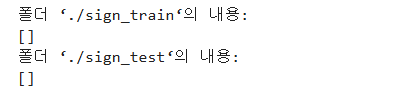

#### 2. ZIP 파일 유효성 검사 & ZIP 파일 압축 해제 및 파일 이동
- sign_train.zip과 sign_test.zip 파일의 압축 해제, 해당 폴더 내용 출력

##### 1. ZIP 파일 경로 설정
```python
train_zip_file = './sign_train.zip' # train_zip_file: 학습 데이터가 포함된 ZIP 파일의 경로. 현재 작업 디렉토리를 기준으로 상대 경로 사용
test_zip_file = './sign_test.zip' # test_zip_file: 테스트 데이터가 포함된 ZIP 파일의 경로
```

##### 2. 최종 저장 경로 설정
```python
train_final_path = './sign_train/' # train_final_path: 학습 데이터가 저장될 폴더의 경로. 현재 작업 디렉토리를 기준으로 상대 경로 사용
test_final_path = './sign_test/' # test_final_path: 테스트 데이터가 저장될 폴더의 경로
```

##### 3. ZIP 파일 유효성 검사 함수 정의
주어진 ZIP 파일의 유효성을 검사하고, 그 내용을 출력하는 함수

```python
def check_zip_file(zip_file_path): # zip_file_path(str): 검사할 ZIP 파일이 경로
    with zipfile.ZipFile(zip_file_path, 'r') as zip_ref: # zipfile.ZipFile(zip_file_path, 'r'): ZIP 파일을 읽기 모드로 연다
        zip_content = zip_ref.namelist() # zip_ref.namelist(): ZIP 파일 내의 모든 파일 및 디렉토리 이름을 리스트로 반환
        return True # return True: 함수가 정상적으로 완료되면 True 반환
```

##### 4. ZIP 파일 압축 해제 함수 정의
주어진 ZIP 파일을 압축 해제 하고, 파일을 지정된 경로로 이동하는 함수

```python
def extract_and_move_files(zip_file_path, final_path): # zip_file_path(str): 압축 해제할 ZIP 파일의 경로
    # final_path(str): 압축 해제된 파일을 저장할 최종 경로
    with zipfile.ZipFile(zip_file_path, 'r') as zip_ref: # zipfile.ZipFile(zip_file_path, 'r'): ZIP 파일을 읽기 모드로 연다
        zip_ref.extractall(final_path) # zip_ref.extractall(final_path): ZIP 파일을 지정된 경로로 압축 해제
    print(f"{zip_file_path} 압축 해제 완료 및 파일 이동 완료!") # print(f"{zip_file_path} 메시지"): 압축 해제 및 파일 이동 완료 메시지 출력
```

##### 5. 파일 경로 및 존재 여부 확인 후 압축 해제
```python
print(f"Checking files: {train_zip_file}, {test_zip_file}") # ZIP 파일 경로 확인 메시지 출력
if os.path.exists(train_zip_file): # SL_train.zip 파일 존재 확인
    if check_zip_file(train_zip_file): # 파일 유효성 검사
        extract_and_move_files(train_zip_file, train_final_path) # ZIP 파일을 압축 해제하여 최종 경로에 저장

if os.path.exists(test_zip_file):
    if check_zip_file(test_zip_file):
        extract_and_move_files(test_zip_file, test_final_path)
```

```python
# 생성된 폴더의 내용 출력
for folder in folders: # 폴더 리스트 순회하며 각 폴더 내용 출력
    print(f"폴더 '{folder}'의 최종 내용:") # 각 폴더의 이름 출력
    print(os.listdir(folder)[:20]) # 각 폴더의 파일 목록을 20개씩 출력
```

##### 최종 결과
1. sign_train.zip 및 sign_test.zip 파일의 경로와 최종 저장 경로를 설정함
2. ZIP 파일의 유효성 검사, 각 파일을 지정된 경로로 압축 해제
3. 각 폴더의 최종 내용을 출력, 압축 해제된 파일 확인

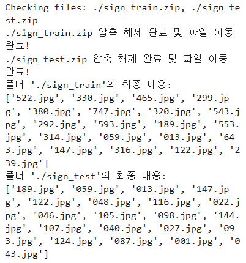

#### 3. train 데이터셋 확인
sign_train.csv 파일을 읽고, 데이터프레임으로 변환한 후, 파일의 첫 몇 줄을 출력하여 내용을 확인. CSV 파일의 구조와 데이터를 빠르게 파악.   
CSV 파일의 첫 몇 줄이 출력되어 각 피처(file_name, label)와 해당 값 구성 확인 가능   

```python
import pandas as pd

csv_file_path = './sign_train.csv'
train_df = pd.read_csv(csv_file_path)

print("sign_train.csv 파일 내용:")
display(train_df.head())
```

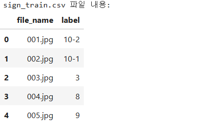

##### label 분포 확인
value_counts() 함수: 각 고유값이 데이터 프레임에 몇 번 나타나는지 계산

```python
print("\n라벨 값 분포:")
display(train_df['label'].value_counts())
```

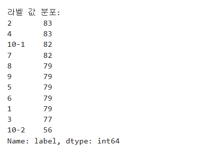

##### 결과 해석
- 라벨의 다양성
- 라벨의 빈도수

#### 4. 라벨 데이터 변환 및 분포 확인
머신러닝 모델은 일반적으로 숫자형 데이터를 입력 받기 때문에,   
문자열 라벨을 숫자형으로 변환해야 함

'10-1', '10-2' 같은 서브클래스 라벨을 각각 '10', '0'으로 변환하여 모델 훈련을 간소화, 라벨의 범주를 일관성 있게 유지

모델 훈련 전 모델을 정리하고 라벨을 적절한 형식으로 변환 -> 모델이 올바르게 처리할 수 있도록

```python
train_df = train_df.replace({'10-1':'10', '10-2':'0'}) # 10-1 -> 10, 10-2 -> 0
train_df['label'] = train_df['label'].apply(lambda x : int(x)) # 라벨 값을 정수형으로 변환

display(train_df['label'].value_counts()) # 라벨 값 분포 확인. 변환된 라벨 값의 분포를 계산하고 출력
```

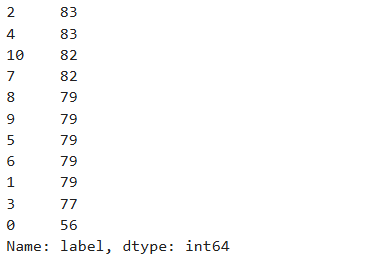

##### 결과 해석
- 라벨 10-1 -> 10 변환
- 라벨 10-2 -> 0 변환
- 라벨 값들 모두 숫자형으로 변환
-> 데이터 전처리 완료 및 모델 훈련을 위한 준비 완료

#### 5. 파일 경로 구조 이해하기

```python
print(os.path.join('sign_train', '*.jpg')) # os.path.join: 서로 다른 경로 요소를 결합하여 하나의 경로로 만듦
```

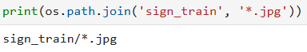
- 운영체제에 맞게 경로를 결합
  - 유닉스 계열 시스템 '/'

```python
from glob import glob # glob: 파일 경로 패턴 매칭을 통해 지정된 경로의 파일 리스트로 변환
print(glob(os.path.join('sign_train', '*.jpg')))
# os.path.join으로 만든 'sign_train/*.jpg'경로를 glob에 전달
# sign_train 폴더 내의 모든 .jpg 파일 경로를 리스트로 반환
```

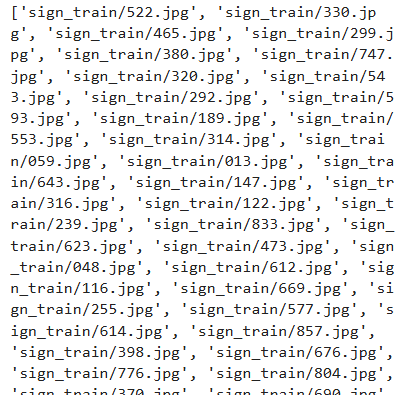

```python
img_path_list = [] # 빈 리스트 만듦
img_path_list.extend(glob(os.path.join('sign_train', '*.jpg')))
# extend 메서드로 glob으로 반환된 파일 경로 리스트를 img_path_list에 추가
# extend는 리스트의 요소를 개별적으로 추가 -> 중첩 X, 파일 경로들이 하나의 리스트로 정리됨
img_path_list # sign_train 폴더의 모든 .jpg 파일 경로를 포함하게 됨
```

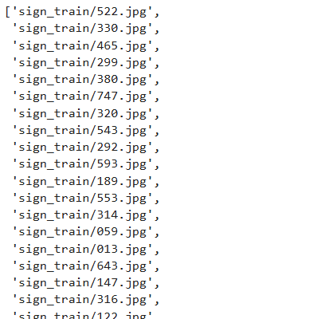

```python
print(img_path_list[0].split('/')[-1])  # 파일 이름만 출력
print(img_path_list[0].split('/')[-1].split('.')[0])  # 파일 이름에서 숫자 부분만 추출하여 출력
```

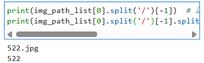

#### 6. 이미지 경로 및 라벨 리스트 생성
이미지 데이터와 레이블 데이터를 가져오는 함수를 정의   
함수는 주어진 디렉토리에서 이미지 파일 경로를 읽고, 레이블 리스트를 생성하여 반환

```python
from glob import glob
import os

def get_train_data(data_dir): # 주어진 디렉토리 data_dir에서 .jpg 확장자를 가진 파일을 대상으로 이미지 파일 경로와 해당 라벨을 수집하여 반환
    # 1. 리스트 초기화
    img_path_list = []
    label_list = []

    # 2. 이미지 경로 수집
    img_path_list.extend(glob(os.path.join(data_dir, '*.jpg')))
    # 이미지 경로 정렬
    img_path_list.sort(key=lambda x: int(x.split('/')[-1].split('.')[0]))  

    # 3. 라벨 할당
    label_list.extend(train_df['label'])
    # 4. 리턴: 이미지 경로 리스트와 라벨 리스트를 튜플로 반환
    return img_path_list, label_list

def get_test_data(data_dir):
    
    img_path_list = []

    img_path_list.extend(glob(os.path.join(data_dir, '*.jpg')))
    img_path_list.sort(key=lambda x: int(x.split('/')[-1].split('.')[0]))

    return img_path_list

# 학습 및 테스트 데이터 로드
all_img_path, all_label = get_train_data('sign_train')
test_img_path = get_test_data('sign_test')

# 샘플 데이터 출력
print(all_img_path[:10])
print(all_label[:10])
```

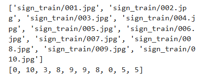

##### 결과 해석
- 이미지 경로
  - 이미지 파일 경로는 sign_train 디렉토리 아래
  - 파일명 001.jpg ~ 010.jpg까지
  - 파일명은 숫자이자 고유한 번호
  - 경로로 정렬된 상태로 출력됨
  - 번호 순서대로 나열
- 디렉토리 구조
  - sign_train이라는 디렉토리에 총 10개의 이미지 파일 포함
  - 순서대로 파일 이름에 번호 붙음
  - 파일 이름이 정렬된 형태는 이미지 데이터가 순차적으로 관리되고 있음을 나타냄
- 이미지 라벨
  - 라벨은 단일 숫자 -> 클래스가 정수형 숫자로 표현된 것
  - 각 숫자는 해당 이미지에 대한 라벨을 나타낸다

#### 7. 랜덤 이미지 샘플링 및 시각화
특정 이미지 파일의 경로를 사용하여 이미지를 열고, 그 이미지 크기를 출력하는 작업

```python
from PIL import Image
import numpy as np
import matplotlib.pyplot as plt

# 이미지를 랜덤으로 16개 선택
sample_indices = np.random.choice(len(all_img_path), 16, replace=False)
sampled_img_paths = [all_img_path[i] for i in sample_indices]
sampled_labels = [all_label[i] for i in sample_indices]

# 4행 4열의 그리드로 이미지 출력
fig, axes = plt.subplots(nrows=4, ncols=4, figsize=(5, 5))

for i, (img_path, label) in enumerate(zip(sampled_img_paths, sampled_labels)):
    ax = axes[i // 4, i % 4]
    img = Image.open(img_path) 
    ax.imshow(img)
    ax.set_title(label)
    ax.axis('off')

plt.tight_layout()
plt.show() 
```


##### 결과 해석
- 가로 세로 224픽셀
  - CNN 같은 딥러닝 모델에서 입력 이미지의 크기로 자주 사용됨

#### 8. 이미지 파일 로드 및 해상도 확인

```python
# img_path = all_img_path[0]: 이미지 파일 경로 설정
# 이미지 리스트 중 첫 번째 이미지 파일을 선택하여 해당 이미지에 대한 작업을 수행

img_path = all_img_path[0]

# 이미지 열기: 이미지 파일을 읽고 Image 객체를 반환
img = Image.open(img_path)

# img.size는 이미지 크기를 (너비, 높이) 형식으로 반환
print(f"Image size (width, height): {img.size}")
```

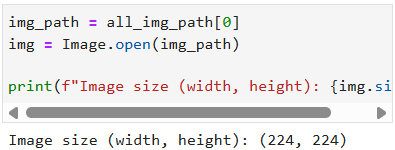

#### 9. 흑백 및 컬러 이미지 식별
이미지 파일을 열어 그 이미지가 흑백인지 컬러인지 확인하는 작업 수행   
Python Imaging Library(PIL)의 Image객체의 mode 속성을 사용하여 이미지 모드를 판단

```python
# 이미지 모드 확인
image_mode = img.mode
print(f"Image mode: {image_mode}")

# 흑백인지 컬러인지 확인
if image_mode == 'L':
    print("The image is in grayscale (black and white).")
elif image_mode in ['RGB', 'RGBA']:
    print("The image is in color.")
else:
    print("The image has a different mode:", image_mode)
```

이미지 모드
- L: 그레이스케일 모드. 각 픽셀은 0부터 255 사이의 밝기 값을 가진다
- RGB: 컬러 모드. 각 픽셀은 빨강, 초록, 파랑(RGB)의 세 가지 값을 가진다
- RGBA: 알파 채널을 포함한 컬러 모드. 투명도 정보를 추가로 가진다
- CMYK: 인쇄용 컬러 모드

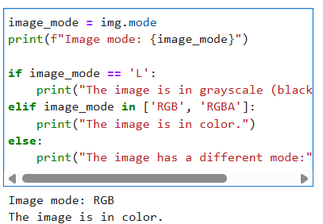