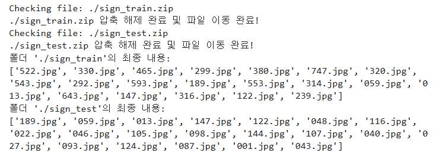
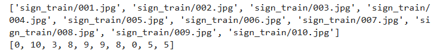

📦 두 번째 단계: 기본 베이스라인 코드
간단한 CNN 모델을 구현하고, 이를 통해 기본적인 이미지 분류 작업을 수행합니다.

### 스테이지1. 기본 베이스라인 코드

학습 목표
- 기본적인 CNN 모델을 구현하고 학습하는 과정을 이해
- PyTorch를 활용한 데이터 전처리 및 데이터셋 생성 방법 익히기
- CNN 모델의 훈련 및 검증 과정 이해
- Albumentations를 사용한 이미지 증강 기법 적용
- 학습된 모델의 성능을 평가하고 시각화하는 방법 학습

#### 들어가며...
- 복잡한 모델보다, 기본적인 베이스라인 설정하여 우리의 데이터가 어떻게 처리되고, 모델이 어떻게 학습되는지 파악한다
- 데이터셋을 처리하고 PyTorch의 Dataset과 DataLoader 클래스를 사용해 데이터를 학습용과 검증용으로 분할
- 이후, 간단한 CNN 모델 정의, 수화 이미지 분류 작업을 수행
- 학습 과정에서의 손실과 정확도를 시각화하여 모델의 성능을 분석

#### 1. ZIP 파일 유효성 검사 및 폴더 내 압축 해제 자동화

```python
import os
import zipfile

# 
def create_folder(path):
    """
    주어진 경로에 폴더를 생성합니다.
    """
    if not os.path.exists(path): # 주어진 경로에 폴더가 존재하지 않으면
        os.makedirs(path) # 새 폴더 생성

def check_zip_file(zip_file_path):
    """
    주어진 ZIP 파일의 유효성을 검사합니다.
    """
    try:
        with zipfile.ZipFile(zip_file_path, 'r') as zip_ref:
            zip_ref.namelist()  # 유효성 검사를 위해 ZIP 파일 내용 리스트를 가져옵니다.
        return True
    except zipfile.BadZipFile: # 만약 파일이 손상되었으면
        print(f"잘못된 ZIP 파일: {zip_file_path}") # 오류 메시지 출력
        return False # 처리 중단

def extract_and_move_files(zip_file_path, final_path):
    """
    주어진 ZIP 파일을 압축 해제하여 지정된 경로로 이동합니다.
    """
    with zipfile.ZipFile(zip_file_path, 'r') as zip_ref:
        zip_ref.extractall(final_path) # 주어진 ZIP 파일 압축 해제 -> 지정된 경로로 이동
    print(f"{zip_file_path} 압축 해제 완료 및 파일 이동 완료!")

def setup_folders_and_extract_files(folders, zip_files):
    """
    폴더를 생성하고 ZIP 파일을 압축 해제합니다.
    """
    # 폴더 생성 및 초기 내용 출력
    for folder in folders:
        create_folder(folder)

    # 파일 경로 및 존재 여부 확인 후 압축 해제
    for zip_file, final_path in zip(zip_files, folders):
        print(f"Checking file: {zip_file}")
        if os.path.exists(zip_file):
            if check_zip_file(zip_file):
                extract_and_move_files(zip_file, final_path)

    # 생성된 폴더의 내용 출력
    for folder in folders:
        print(f"폴더 '{folder}'의 최종 내용:")
        print(os.listdir(folder)[:20])

# 메인 실행 부분
# 실행될 폴더와 ZIP 파일의 경로를 리스트로 지정
folders = ['./sign_train', './sign_test']
zip_files = ['./sign_train.zip', './sign_test.zip']

# 전체 프로세스 실행
setup_folders_and_extract_files(folders, zip_files)
```

1. 폴더 생성: create_folder 함수
2. ZIP 파일 검사: check_zip_file 함수
3. 압축 해제 및 파일 이동: extract_and_move_files 함수
4. 폴더 내용 출력



#### 2.CSV 파일 레이블 변환 및 레이블 빈도 분석

```python
import pandas as pd

csv_file_path = './sign_train.csv'
train_df = pd.read_csv(csv_file_path) # 데이터 로드: CSV 파일 데이터 읽기

train_df = train_df.replace({'10-1':'10', '10-2':'0'}) # 데이터 치환
train_df['label'] = train_df['label'].apply(lambda x : int(x)) # 데이터 형식 변환: 라벨 데이터를 문자열 -> 정수형

display(train_df['label'].value_counts()) # 라벨 분포 확인: 각 라벨의 빈도수를 계산, 출력
```


#### 3.이미지 경로 및 라벨 리스트 생성

glob와 os모듈을 사용해서 지정된 디렉토리 내의 이미지 파일 경로를 가져오고, 그에 해당하는 라벨과 함께 반환하는 함수를 정의
- 학습 데이터와 테스트 데이터를 준비하여 이후 모델 학습 및 평가에 활용할 수 있도록 데이터 전처리 수행
- 이미지를 경로에 따라 정렬하여 정렬된 순서에 맞게 라벨을 부여하는 일관성 유지

-> 이 코드를 통해 학습과 테스트에 필요한 데이터의 이미지 경로를 정리하고, 학습 데이터에 라벨을 부여하는 작업을 자동화한다.

```python
from glob import glob
import os

# 훈련 데이터의 이미지 경로와 라벨 반환
def get_train_data(data_dir):
    img_path_list = []
    label_list = []

    img_path_list.extend(glob(os.path.join(data_dir, '*.jpg')))
    img_path_list.sort(key=lambda x: int(x.split('/')[-1].split('.')[0]))  

    label_list.extend(train_df['label'])
    return img_path_list, label_list

# 테스트 데이터의 이미지 경로만 반환
def get_test_data(data_dir):
    
    img_path_list = []
    
    img_path_list.extend(glob(os.path.join(data_dir, '*.jpg')))
    img_path_list.sort(key=lambda x: int(x.split('/')[-1].split('.')[0]))

    return img_path_list

# 학습 이미지 경로와 라벨
all_img_path, all_label = get_train_data('sign_train')
# 테스트 이미지 경로
test_img_path = get_test_data('sign_test')

print(all_img_path[:10])
print(all_label[:10])
```



#### 4.Albumentations를 활용한 이미지 데이터 전처리 및 변환

Albumentations 라이브러리를 사용하여 "수화 이미지" 데이터셋을 위한 이미지 전처리 및 변환 파으피라인을 정의한다

***Albumentations 라이브러리***
- 이미지 데이터 증강(Albumentation)과 전처리를 위한 라이브러리
- 다양한 이미지 변환 기법을 쉽게 적용할 수 있는 기능 제공
- 컴퓨터 비전 분야의 데이터 증강에 최적화되어 있다

```python
import albumentations as A
from albumentations.pytorch import ToTensorV2 

train_transform = A.Compose([
    A.Resize(64, 64),
    # mean=(0.485, 0.456, 0.406) 정규화할 때 사용할 평균 값
    # std=(0.229, 0.224, 0.225) 정규화할 때 사용할 표준편차 값
    # max_pixel_value=255.0 이미지 최대 픽셀 값
    # p=1.0 이 변환을 항상 적용하도록 설정
    A.Normalize(mean=(0.485, 0.456, 0.406), std=(0.229, 0.224, 0.225), max_pixel_value=255.0, always_apply=False, p=1.0),
    ToTensorV2()
])

test_transform = A.Compose([
    A.Resize(64, 64),
    A.Normalize(mean=(0.485, 0.456, 0.406), std=(0.229, 0.224, 0.225), max_pixel_value=255.0, always_apply=False, p=1.0),
    ToTensorV2()
])
```

1. A.Compose()
- 여러 변환을 순차적으로 적용할 수 있도록 변환 파이프라인을 정의한다
  - 데이터 전처리 및 증강 과정을 하나의 파이프라인으로 구성하여 일관되게 사용할 수 있도록

2. A.Resize(64, 64)
- 이미지를 64*64 크기로 조정
- 모든 이미지를 동일한 크기로 벼환하여 모델 입력에 적합하도록
  - resize를 하는 이유
    1. 모델의 경량화: 224*224 크기는 높은 해상도 -> 더 많은 계산. 모델의 파라미터 수를 감소시켜 경량화된 모델 설계.
    2. 처리 효율성: 더 작은 입력 크기는 연산 속도를 빠르게 하여 모델의 추론(inference) 시간을 단축시킴. 실험을 빠르게 반복할 수 있다.

3. A.Normalize(mean, std)
- 이미지의 픽셀 값을 0과 1 사이의 값으로 변환한 다음, 주어진 평균과 표준편차를 사용하여 정규화

**정규화 과정**
1. 픽셀 값을 0과 1 사이로 변환
2. 평균을 빼고 표준편차로 나눔
-> 픽셀 값이 정규화되고 모델의 입력으로 사용될 수 있는 값으로 변환

4. ToTensorV2()
- 이미지를 PyTorch 텐서(tensor) 형식으로 변환
- 텐서는 모델 입력에 필요한 데이터 구조이며, 이는 GPU에서의 연산을 지원