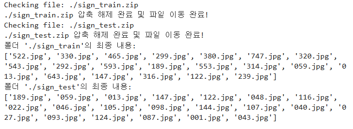
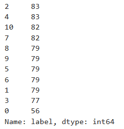
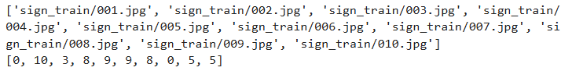
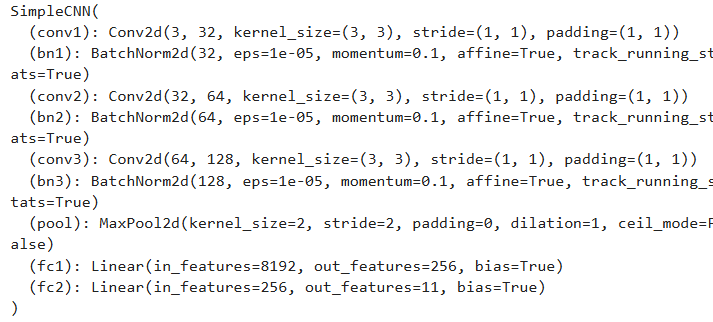
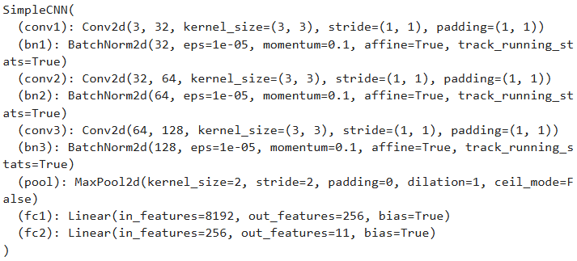
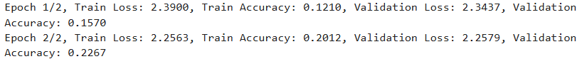
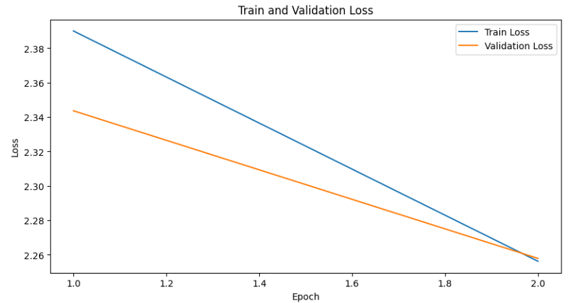
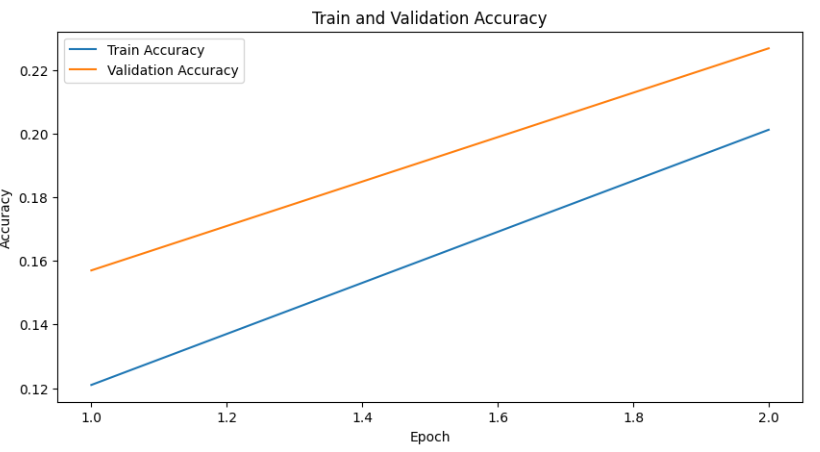

#### 1. ZIP 파일 유효성 검사 및 폴더 내 압축 해제 자동화

```python
import os
import zipfile

def create_folder(path):
    """
    주어진 경로에 폴더를 생성합니다.
    """
    if not os.path.exists(path):
        os.makedirs(path)

def check_zip_file(zip_file_path):
    """
    주어진 ZIP 파일의 유효성을 검사합니다.
    """
    try:
        with zipfile.ZipFile(zip_file_path, 'r') as zip_ref:
            zip_ref.namelist()  # 유효성 검사를 위해 ZIP 파일 내용 리스트를 가져옵니다.
        return True
    except zipfile.BadZipFile:
        print(f"잘못된 ZIP 파일: {zip_file_path}")
        return False

def extract_and_move_files(zip_file_path, final_path):
    """
    주어진 ZIP 파일을 압축 해제하여 지정된 경로로 이동합니다.
    """
    with zipfile.ZipFile(zip_file_path, 'r') as zip_ref:
        zip_ref.extractall(final_path)
    print(f"{zip_file_path} 압축 해제 완료 및 파일 이동 완료!")

def setup_folders_and_extract_files(folders, zip_files):
    """
    폴더를 생성하고 ZIP 파일을 압축 해제합니다.
    """
    # 폴더 생성 및 초기 내용 출력
    for folder in folders:
        create_folder(folder)

    # 파일 경로 및 존재 여부 확인 후 압축 해제
    for zip_file, final_path in zip(zip_files, folders):
        print(f"Checking file: {zip_file}")
        if os.path.exists(zip_file):
            if check_zip_file(zip_file):
                extract_and_move_files(zip_file, final_path)

    # 생성된 폴더의 내용 출력
    for folder in folders:
        print(f"폴더 '{folder}'의 최종 내용:")
        print(os.listdir(folder)[:20])

# 사용 예시
folders = ['./sign_train', './sign_test']
zip_files = ['./sign_train.zip', './sign_test.zip']

setup_folders_and_extract_files(folders, zip_files)
```


#### 2.CSV 파일 레이블 변환 및 레이블 빈도 분석
```python
import pandas as pd

csv_file_path = './sign_train.csv'
train_df = pd.read_csv(csv_file_path)

train_df = train_df.replace({'10-1':'10', '10-2':'0'})
train_df['label'] = train_df['label'].apply(lambda x : int(x))

display(train_df['label'].value_counts())
```


#### 3.이미지 경로 및 라벨 리스트 생성
```python
from glob import glob
import os

def get_train_data(data_dir):
    img_path_list = []
    label_list = []

    img_path_list.extend(glob(os.path.join(data_dir, '*.jpg')))
    img_path_list.sort(key=lambda x: int(x.split('/')[-1].split('.')[0]))  

    label_list.extend(train_df['label'])
    return img_path_list, label_list

def get_test_data(data_dir):
    
    img_path_list = []

    img_path_list.extend(glob(os.path.join(data_dir, '*.jpg')))
    img_path_list.sort(key=lambda x: int(x.split('/')[-1].split('.')[0]))

    return img_path_list
all_img_path, all_label = get_train_data('sign_train')
test_img_path = get_test_data('sign_test')

print(all_img_path[:10])
print(all_label[:10])
```


#### 4.Albumentations를 활용한 이미지 데이터 전처리 및 변환

```python
import albumentations as A
from albumentations.pytorch import ToTensorV2

train_transform = A.Compose([
    A.Resize(64, 64),
    A.HorizontalFlip(p=0.5),  
    A.Rotate(limit=45, p=0.5), 
    A.Normalize(mean=(0.485, 0.456, 0.406), std=(0.229, 0.224, 0.225), max_pixel_value=255.0, always_apply=False, p=1.0),
    ToTensorV2()
])

test_transform = A.Compose([
    A.Resize(64, 64),
    A.Normalize(mean=(0.485, 0.456, 0.406), std=(0.229, 0.224, 0.225), max_pixel_value=255.0, always_apply=False, p=1.0),
    ToTensorV2()
])
```

#### 5. PyTorch 커스텀 데이터셋 클래스 구현: 이미지 로드 및 변환

```python
from torch.utils.data import Dataset, DataLoader

class CustomDataset(Dataset):
    def __init__(self, img_paths, labels=None, transform=None):
        self.img_paths = img_paths
        self.labels = labels
        self.transform = transform

    def __len__(self):
        return len(self.img_paths)

    def __getitem__(self, idx):
        img_path = self.img_paths[idx]
        image = cv2.imread(img_path)
        image = cv2.cvtColor(image, cv2.COLOR_BGR2RGB)

        if self.transform:
            augmented = self.transform(image=image)
            image = augmented['image']

        if self.labels is not None:
            label = self.labels[idx]
            return image, label
        else:
            return image
```

#### 6.이미지 데이터 학습 및 검증 세트 분할과 PyTorch DataLoader 설정

```python
from sklearn.model_selection import train_test_split

train_img_paths, val_img_paths, train_labels, val_labels = train_test_split(all_img_path, all_label, test_size=0.2, random_state=42)

train_dataset = CustomDataset(train_img_paths, train_labels, transform=train_transform)
val_dataset = CustomDataset(val_img_paths, val_labels, transform=test_transform)

train_loader = DataLoader(train_dataset, batch_size=32, shuffle=True)
val_loader = DataLoader(val_dataset, batch_size=32, shuffle=False)

print(f"train_loader에서 생성되는 배치(batch)의 수: {len(train_loader)}")
print(f"val_loader에서 생성되는 배치(batch)의 수: {len(val_loader)}")
```

#### 7.PyTorch를 사용한 간단한 CNN 모델 구현 및 초기화

```python
import torch
import torch.nn as nn
import torch.nn.functional as F

class SimpleCNN(nn.Module):
    def __init__(self, num_classes):
        super(SimpleCNN, self).__init__()
        # 합성곱 레이어 1: 입력 이미지를 32개의 채녈로 변환, 배치 정규화(bn1)를 적용하여 학습 안정화
        self.conv1 = nn.Conv2d(3, 32, kernel_size=3, padding=1)
        self.bn1 = nn.BatchNorm2d(32)
        # 합성곱 레이어 2: 입력 이미지를 32개의 채널로 변환, 배치 정규화(bn1)를 적용하여 학습 안정화
        self.conv2 = nn.Conv2d(32, 64, kernel_size=3, padding=1)
        self.bn2 = nn.BatchNorm2d(64)
        # 합성곱 레이어 3: 64개의 채널을 128개의 채널로 변환, 배치 정규화(bn3)를 적용
        self.conv3 = nn.Conv2d(64, 128, kernel_size=3, padding=1)
        self.bn3 = nn.BatchNorm2d(128)
        # 최대 풀링 레이어: 각 합성곱 레이어 뒤에 배치되어 특징 맵의 크기를 절반으로 축소
        self.pool = nn.MaxPool2d(kernel_size=2, stride=2, padding=0)
        # 완전 연결 레이어 1: 마지막 풀링된 특징 맵을 256차원 벡터로 변환
        self.fc1 = nn.Linear(128 * 8 * 8, 256)
        # 완견 연결 레이어 2: 출력 클래스의 수에 맞게 최종 예측값 생성
        self.fc2 = nn.Linear(256, num_classes)

    def forward(self, x):
        x = self.pool(F.relu(self.bn1(self.conv1(x))))
        x = self.pool(F.relu(self.bn2(self.conv2(x))))
        x = self.pool(F.relu(self.bn3(self.conv3(x))))
        x = x.view(-1, 128 * 8 * 8)
        x = F.relu(self.fc1(x))
        x = self.fc2(x)
        return x

# 모델 생성
num_classes = len(train_df['label'].unique())
model = SimpleCNN(num_classes)
print(model)
```


#### 8.PyTorch 모델 학습 및 검증 함수 구현

```python
# 학습 함수 정의
def train(model, criterion, optimizer, train_loader):
    model.train()
    running_loss = 0.0
    corrects = 0
    for images, labels in train_loader:
        images, labels = images.float(), labels.long()  # 데이터 타입 변환
        images, labels = images.to(device), labels.to(device)
        optimizer.zero_grad()
        outputs = model(images)
        loss = criterion(outputs, labels)
        loss.backward()
        optimizer.step()
        running_loss += loss.item()
        _, preds = torch.max(outputs, 1)
        corrects += torch.sum(preds == labels.data)
    epoch_loss = running_loss / len(train_loader)
    epoch_acc = corrects.double() / len(train_loader.dataset)
    return epoch_loss, epoch_acc
```

```python
# 검증 함수 정의
def validate(model, criterion, val_loader):
    # 모드 설정
    model.eval()
    # 초기화
    val_loss = 0.0
    val_corrects = 0
    # 배치 처리
    with torch.no_grad():
        for images, labels in val_loader:
            images, labels = images.float(), labels.long()  # 데이터 타입 변환
            images, labels = images.to(device), labels.to(device) # 데이터를 GPU OR CPU로 이동
            # 모델 예측
            outputs = model(images)
            loss = criterion(outputs, labels)
            # 정확도 및 손실 추적
            val_loss += loss.item()
            _, preds = torch.max(outputs, 1)
            val_corrects += torch.sum(preds == labels.data)
    # 에포크 손실 및 정확도 계산        
    epoch_loss = val_loss / len(val_loader)
    epoch_acc = val_corrects.double() / len(val_loader.dataset)
    return epoch_loss, epoch_acc
```

#### 9.PyTorch 모델 학습 준비: 손실 함수, 옵티마이저 설정 및 기본 환경 설정

```python
import torch.optim as optim

# 손실 함수 및 옵티마이저 정의
criterion = nn.CrossEntropyLoss()
optimizer = torch.optim.SGD(model.parameters(), lr=0.001, momentum=0.9, nesterov=True)

# 성능 결과를 저장할 리스트
train_losses = []
train_accuracies = []
val_losses = []
val_accuracies = []

# 모델 학습 및 검증
num_epochs = 2
device = torch.device("cuda" if torch.cuda.is_available() else "cpu")
model.to(device)
```


#### 10.PyTorch를 활용한 모델 학습 및 검증 루프 구현

```python
import cv2

for epoch in range(num_epochs):
    train_loss, train_acc = train(model, criterion, optimizer, train_loader)
    val_loss, val_acc = validate(model, criterion, val_loader)
    
    train_losses.append(train_loss)
    train_accuracies.append(train_acc.item())
    val_losses.append(val_loss)
    val_accuracies.append(val_acc.item())
    
    print(f"Epoch {epoch+1}/{num_epochs}, "
          f"Train Loss: {train_loss:.4f}, "
          f"Train Accuracy: {train_acc:.4f}, "
          f"Validation Loss: {val_loss:.4f}, "
          f"Validation Accuracy: {val_acc:.4f}")
```


#### 11.학습 및 검증 성능 시각화: 손실과 정확도 그래프
```python
import matplotlib.pyplot as plt

# 학습 및 검증 손실 그래프
plt.figure(figsize=(10, 5))
plt.plot(range(1, num_epochs + 1), train_losses, label='Train Loss')
plt.plot(range(1, num_epochs + 1), val_losses, label='Validation Loss')
plt.xlabel('Epoch')
plt.ylabel('Loss')
plt.title('Train and Validation Loss')
plt.legend()
plt.show()

# 학습 및 검증 정확도 그래프
plt.figure(figsize=(10, 5))
plt.plot(range(1, num_epochs + 1), train_accuracies, label='Train Accuracy')
plt.plot(range(1, num_epochs + 1), val_accuracies, label='Validation Accuracy')
plt.xlabel('Epoch')
plt.ylabel('Accuracy')
plt.title('Train and Validation Accuracy')
plt.legend()
plt.show()
```

