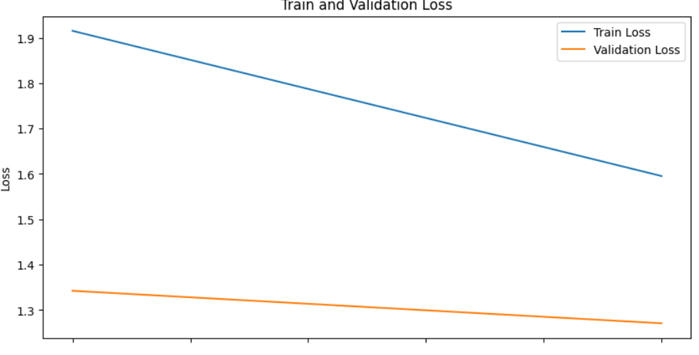

#### 1. ZIP 파일 유효성 검사 및 폴더 내 압축 해제 자동화

```python
import os
import zipfile

def create_folder(path):
    """
    주어진 경로에 폴더를 생성합니다.
    """
    if not os.path.exists(path):
        os.makedirs(path)

def check_zip_file(zip_file_path):
    """
    주어진 ZIP 파일의 유효성을 검사합니다.
    """
    try:
        with zipfile.ZipFile(zip_file_path, 'r') as zip_ref:
            zip_ref.namelist()  # 유효성 검사를 위해 ZIP 파일 내용 리스트를 가져옵니다.
        return True
    except zipfile.BadZipFile:
        print(f"잘못된 ZIP 파일: {zip_file_path}")
        return False

def extract_and_move_files(zip_file_path, final_path):
    """
    주어진 ZIP 파일을 압축 해제하여 지정된 경로로 이동합니다.
    """
    with zipfile.ZipFile(zip_file_path, 'r') as zip_ref:
        zip_ref.extractall(final_path)
    print(f"{zip_file_path} 압축 해제 완료 및 파일 이동 완료!")

def setup_folders_and_extract_files(folders, zip_files):
    """
    폴더를 생성하고 ZIP 파일을 압축 해제합니다.
    """
    # 폴더 생성 및 초기 내용 출력
    for folder in folders:
        create_folder(folder)

    # 파일 경로 및 존재 여부 확인 후 압축 해제
    for zip_file, final_path in zip(zip_files, folders):
        print(f"Checking file: {zip_file}")
        if os.path.exists(zip_file):
            if check_zip_file(zip_file):
                extract_and_move_files(zip_file, final_path)

    # 생성된 폴더의 내용 출력
    for folder in folders:
        print(f"폴더 '{folder}'의 최종 내용:")
        print(os.listdir(folder)[:20])

# 사용 예시
folders = ['./sign_train', './sign_test']
zip_files = ['./sign_train.zip', './sign_test.zip']

setup_folders_and_extract_files(folders, zip_files)
```


#### 2.CSV 파일 레이블 변환

```python
import pandas as pd

csv_file_path = './sign_train.csv'
train_df = pd.read_csv(csv_file_path)

train_df = train_df.replace({'10-1':'10', '10-2':'0'})
train_df['label'] = train_df['label'].apply(lambda x : int(x))
```

#### 3.이미지 경로 및 라벨 리스트 생성

```python
from glob import glob
import os

def get_train_data(data_dir):
    img_path_list = []
    label_list = []

    img_path_list.extend(glob(os.path.join(data_dir, '*.jpg')))
    img_path_list.sort(key=lambda x: int(x.split('/')[-1].split('.')[0]))  

    label_list.extend(train_df['label'])
    return img_path_list, label_list

def get_test_data(data_dir):
    
    img_path_list = []

    img_path_list.extend(glob(os.path.join(data_dir, '*.jpg')))
    img_path_list.sort(key=lambda x: int(x.split('/')[-1].split('.')[0]))

    return img_path_list
all_img_path, all_label = get_train_data('sign_train')
test_img_path = get_test_data('sign_test')

print(all_img_path[:10])
print(all_label[:10])
```


#### 4.이미지 데이터 변환

```python
import albumentations as A
from albumentations.pytorch import ToTensorV2

train_transform = A.Compose([
    A.Resize(64, 64),  
    A.OneOf([  # 여러 증강 중 하나를 무작위로 선택하여 적용
    A.HorizontalFlip(p=0.5),
    A.VerticalFlip(p=0.5),
    A.RandomRotate90(p=0.5)
], p=0.5),

    
    A.OneOf([  # 밝기, 대비, 색조, 채도 등 색상 관련 증강 중 하나를 무작위로 선택
        A.RandomBrightnessContrast(brightness_limit=0.2, contrast_limit=0.2, p=0.5),
        A.HueSaturationValue(hue_shift_limit=20, sat_shift_limit=30, val_shift_limit=20, p=0.5),
        A.RGBShift(r_shift_limit=20, g_shift_limit=20, b_shift_limit=20, p=0.5)
    ], p=0.5),
    A.OneOf([  # 블러, 노이즈, 모자이크 효과 등 중 하나를 무작위로 선택
        A.GaussianBlur(blur_limit=(3, 7), p=0.5),
        A.MotionBlur(blur_limit=7, p=0.5),
        A.MedianBlur(blur_limit=7, p=0.5)
    ], p=0.5),
    A.OneOf([  # 부분적으로 픽셀을 제거하거나 드롭아웃 효과를 무작위로 선택
        A.CoarseDropout(max_holes=8, max_height=16, max_width=16, p=0.5)
    ], p=0.5),
    A.Normalize(mean=(0.485, 0.456, 0.406), std=(0.229, 0.224, 0.225), max_pixel_value=255.0),
    ToTensorV2()
])

test_transform = A.Compose([
    A.Resize(64, 64), 
    A.Normalize(mean=(0.485, 0.456, 0.406), std=(0.229, 0.224, 0.225), max_pixel_value=255.0),
    ToTensorV2()
])
```

#### 5. PyTorch 커스텀 데이터셋 클래스 구현 및 DataLoader 설정

```python
import cv2
from torch.utils.data import Dataset, DataLoader
from sklearn.model_selection import train_test_split

# 사용자 정의 데이터셋 클래스
class CustomDataset(Dataset):
    def __init__(self, img_paths, labels=None, transform=None):
        self.img_paths = img_paths
        self.labels = labels
        self.transform = transform

    def __len__(self):
        return len(self.img_paths)

    def __getitem__(self, idx):
        img_path = self.img_paths[idx]
        image = cv2.imread(img_path)
        image = cv2.cvtColor(image, cv2.COLOR_BGR2RGB)

        if self.transform:
            augmented = self.transform(image=image)
            image = augmented['image']

        if self.labels is not None:
            label = self.labels[idx]
            return image, label
        else:
            return image
        
# 데이터셋 및 데이터로더 정의
train_img_paths, val_img_paths, train_labels, val_labels = train_test_split(all_img_path, all_label, test_size=0.2, random_state=42)

train_dataset = CustomDataset(train_img_paths, train_labels, transform=train_transform)
val_dataset = CustomDataset(val_img_paths, val_labels, transform=test_transform)

train_loader = DataLoader(train_dataset, batch_size=32, shuffle=True)
val_loader = DataLoader(val_dataset, batch_size=32, shuffle=False)
```

#### 6.AlexNet 사전학습 모델 불러오기

```python
import torch
import torch.nn as nn
from torchvision import models

model = models.alexnet(pretrained=True)
print(f"[변경 전 모델]\n", model)
```


```python
num_classes = len(train_df['label'].unique())
model.classifier[6] = nn.Linear(model.classifier[6].in_features, num_classes)
print(f"[변경 후 모델]\n", model)
```


#### 7.PyTorch 모델 학습 및 검증 함수 구현

```python
# 학습 함수 정의
def train(model, criterion, optimizer, train_loader):
    
    model.train()
    running_loss = 0.0
    corrects = 0
    
    for images, labels in tqdm(train_loader):
        images, labels = images.float(), labels.long()  
        images, labels = images.to(device), labels.to(device)
        
        optimizer.zero_grad()
        outputs = model(images)
        loss = criterion(outputs, labels)
        loss.backward()
        optimizer.step()
        running_loss += loss.item()
        
        _, preds = torch.max(outputs, 1)
        corrects += torch.sum(preds == labels.data)
        
    epoch_loss = running_loss / len(train_loader)
    epoch_acc = corrects.double() / len(train_loader.dataset)
    return epoch_loss, epoch_acc
```
```python
# 검증 함수 정의
def validate(model, criterion, val_loader):
    
    model.eval()
    val_loss = 0.0
    val_corrects = 0
    
    with torch.no_grad():
        for images, labels in tqdm(val_loader):
            images, labels = images.float(), labels.long()  
            images, labels = images.to(device), labels.to(device)
            
            outputs = model(images)
            loss = criterion(outputs, labels)
            val_loss += loss.item()
            _, preds = torch.max(outputs, 1)
            val_corrects += torch.sum(preds == labels.data)
            
    epoch_loss = val_loss / len(val_loader)
    epoch_acc = val_corrects.double() / len(val_loader.dataset)
    return epoch_loss, epoch_acc
```

#### 8.PyTorch 모델 학습 준비: 손실 함수, 옵티마이저 설정 및 기본 환경 설정

```python
from tqdm import tqdm
import torch.optim as optim
import matplotlib.pyplot as plt

# 손실 함수 및 옵티마이저 정의
criterion = nn.CrossEntropyLoss()
optimizer = optim.Adam(model.parameters(), lr=0.0001)

# 성능 결과를 저장할 리스트
train_losses = []
train_accuracies = []
val_losses = []
val_accuracies = []

# 모델 학습 및 검증
num_epochs = 2
device = torch.device("cuda" if torch.cuda.is_available() else "cpu")
model.to(device)

for epoch in range(num_epochs):
    train_loss, train_acc = train(model, criterion, optimizer, train_loader)
    val_loss, val_acc = validate(model, criterion, val_loader)
    train_losses.append(train_loss)
    train_accuracies.append(train_acc.item())
    val_losses.append(val_loss)
    val_accuracies.append(val_acc.item())
    print(f"Epoch {epoch+1}/{num_epochs}, "
          f"Train Loss: {train_loss:.4f}, "
          f"Train Accuracy: {train_acc:.4f}, "
          f"Validation Loss: {val_loss:.4f}, "
          f"Validation Accuracy: {val_acc:.4f}")

# 학습 및 검증 손실 그래프
plt.figure(figsize=(10, 5))
plt.plot(range(1, num_epochs + 1), train_losses, label='Train Loss')
plt.plot(range(1, num_epochs + 1), val_losses, label='Validation Loss')
plt.xlabel('Epoch')
plt.ylabel('Loss')
plt.title('Train and Validation Loss')
plt.legend()
plt.show()

# 학습 및 검증 정확도 그래프
plt.figure(figsize=(10, 5))
plt.plot(range(1, num_epochs + 1), train_accuracies, label='Train Accuracy')
plt.plot(range(1, num_epochs + 1), val_accuracies, label='Validation Accuracy')
plt.xlabel('Epoch')
plt.ylabel('Accuracy')
plt.title('Train and Validation Accuracy')
plt.legend()
plt.show()
```



#### 9.추론

```python
from tqdm import tqdm

# 추론 함수 정의
def predict(model, test_loader, device):
    model.eval()
    model_pred = []
    with torch.no_grad():
        for img in tqdm(iter(test_loader)):
            img = img.to(device)
            pred_logit = model(img)
            pred_logit = pred_logit.argmax(dim=1, keepdim=True).squeeze(1)
            model_pred.extend(pred_logit.tolist())
    return model_pred

# 테스트 데이터 로드
test_dataset = CustomDataset(test_img_path, labels=None, transform=test_transform)
test_loader = DataLoader(test_dataset, batch_size=16, shuffle=False)

preds = predict(model, test_loader, device)
preds[:10]
```


#### 10.라벨 값 변환

```python
preds = ["10-1" if x == 10 else x for x in preds]
preds = ["10-2" if x == 0 else x for x in preds]

print(preds)
```


#### 11.제출

```python
submission = pd.read_csv('sample_submission.csv')
submission['label'] = preds

submission.to_csv('submission.csv', index=False)
```
